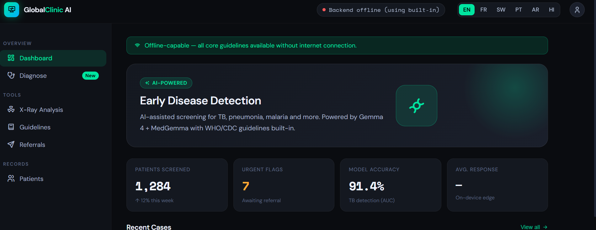

# Renee Ngai: Portfolio

Hi! My name is Renee Ngai, an undergraduate student studying data science and economics at Emory University. This is my portfolio that showcases my work outside of academics through clubs, hackathons, and past work experiences. My passion involves building predictive models, LLM apps, and turning messy data into clear decisions.

Courses: Statistical Programming I and II (R, SQL, Python), Advanced Calculus, Macroeconomics, Data Science for Economists

Core Technical Skills:
Programming: SQL, Python, Bash, R, Java, JavaScript  | Visualization: ggplot, PowerBI, Excel, matplotlib | Cloud: AWS 
Cloud: AWS EC2 | LLM: RAG, Hugging Face, Prompt Engineering |Machine Learning: Scikit-learn, Tensorflow, PyTorch

# Projects

### Yahoo Finance Machine Learning & Trading Analysis: Northeast Big Data Innovation Hub

This project from the Northeast Big Data Innovation Hub focuses on applying data science and machine learning techniques to financial market analysis using stock data from Yahoo Finance. It includes data preprocessing, exploratory data analysis, technical indicators, trading strategy design, backtesting, portfolio optimization, and predictive modeling. The project explores moving averages, technical indicators, and trading strategies such as Moving Average Crossover and Mean Reversion. It incorporates machine learning models to forecast stock returns, evaluates their performance using multiple metrics, and visualizes the results. Additionally, it introduces core financial models such as the Capital Asset Pricing Model (CAPM) and the Efficient Frontier.

Estimate each stock's CAPM alpha and beta coefficients by regressing their excess returns against the market's (S&P 500) returns

The Capital Asset Pricing Model is given by the following equation :

$$
R_i - R_f \;=\; \alpha_i \;+\; \beta_i\,(R_m - R_f)\;+\;\varepsilon_i
$$

I then ran CAPM Regression for each stock to estimate alpha and beta of each stock, build and plot the efficient frontier for a 5 stock portfolio, and find the lowest votality of the assets.
<a href="https://github.com/reneengai126/portfolio/blob/main/Yahoo_Finance_Project_Renee_ngai.ipynb" target="_blank">Github link</a>

### GlobalClinic AI: Early Disease Detection and Diagnosis for Google Gemma Hackathon

An offline-capable, multilingual clinical decision support system targeting rural clinics in low-resource settings. Fine-tunes Gemma 4 (E4B) on tuberculosis, pneumonia, malaria, and malnutrition datasets, then wraps the model in a RAG pipeline grounded in WHO/CDC guidelines for accurate, context-aware disease detection.

Methods: The system combines lightweight language modeling with medical imaging intelligence to provide accurate and accessible diagnostic support. The primary foundation model used in this project is Google’s Gemma model, specifically the google/gemma-4-e4b-it variant. This model was selected because it is optimized for edge deployment, allowing it to run efficiently on devices with limited computational resources such as Android tablets and Raspberry Pi systems. Its smaller memory footprint makes it suitable for offline healthcare environments where internet connectivity is unreliable or unavailable.

The models were fine-tuned using Low-Rank Adaptation (LoRA), which significantly reduces training costs and memory usage while still enabling high-quality domain adaptation. LoRA allowed the project to train efficiently on limited GPU resources while maintaining strong diagnostic performance.

Challenges: Designing the system to work fully offline introduced additional engineering challenges. Most modern AI systems rely heavily on cloud computing, but rural clinics may lack stable connectivity. To solve this, the project integrated a local FAISS vector database containing offline WHO and CDC medical guidelines, enabling retrieval-augmented responses without internet access. The models were also optimized for lightweight deployment on devices such as Raspberry Pi systems and Android tablets.

<a href="https://github.com/reneengai126/portfolio/blob/main/globalclinic-ai-disease-detection-using-gemma-4.ipynb">Github link</a>

### ML Engineering · Emory AI Data Lab - XGBoost Hotspot Predictor

Invest Atlanta is Atlanta's economic development agency. With 2026 FIFA and 2028 Super Bowl approaching, predicting MARTA ridership hotspots is critical for maximizing ROI for local businesses. Built an XGBoost model trained on historical MARTA trip data to forecast high-ridership train station hotspots around major events.

Goals: Invest Atlanta is the Atlanta’s economic development agency, and with 2026 FIFA and 2028 super bowl coming up, predicting hotspots of train station ridership is important for maximizing return on investment for local businesses. In this project we aim to develop an XGBoost model to predict train ridership trip destinations with past Marta data.

Conclusions: Event attendance is the primary determinant of MARTA ridership spikes, producing consistent, scalable surges independent of weather. Also, surge effects are spatially concentrated: Vine City, Dome/GWCC, and CNN Center account for the majority of load, enabling targeted staffing and optimized headways. Lastly, Actual vs. Predicted trips graph shows that XGBoost model accurately predicts the actual trips trend.

<a href="https://github.com/brodyw52/Ai-Data-Lab">Github link</a>

