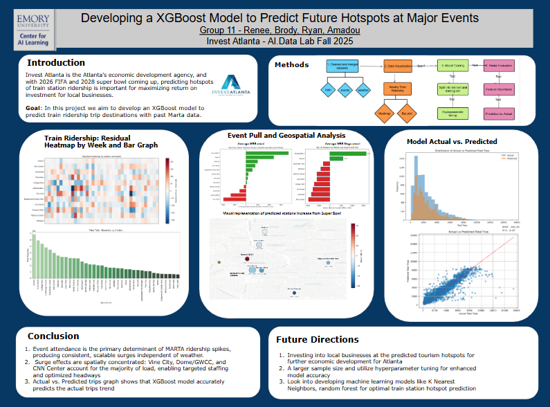

# Renee Ngai: Portfolio

Hi! My name is Renee Ngai, an undergraduate student studying data science and economics at Emory University. This is my portfolio that showcases my work outside of academics through clubs, hackathons, and past work experiences. My passion involves building predictive models, LLM apps, and turning messy data into clear decisions.

Courses: Statistical Programming I and II (R, SQL, Python), Advanced Calculus, Macroeconomics, Data Science for Economists

Core Technical Skills:
Programming: SQL, Python, Bash, R, Java, JavaScript  | Visualization: ggplot, PowerBI, Excel, matplotlib | Cloud: AWS 
Cloud: AWS EC2 | LLM: RAG, Hugging Face, Prompt Engineering |Machine Learning: Scikit-learn, Tensorflow, PyTorch

# Projects

### GlobalClinic AI

An offline-capable, multilingual clinical decision support system targeting rural clinics in low-resource settings. Fine-tunes Gemma 4 (E4B) on tuberculosis, pneumonia, malaria, and malnutrition datasets, then wraps the model in a RAG pipeline grounded in WHO/CDC guidelines for accurate, context-aware disease detection.

<a href="https://github.com/reneengai126/portfolio/blob/main/globalclinic-ai-disease-detection-using-gemma-4.ipynb">Github link</a>

### ML Engineering · Emory AI Data Lab - XGBoost Hotspot Predictor

Invest Atlanta is Atlanta's economic development agency. With 2026 FIFA and 2028 Super Bowl approaching, predicting MARTA ridership hotspots is critical for maximizing ROI for local businesses. Built an XGBoost model trained on historical MARTA trip data to forecast high-ridership train station hotspots around major events.

<a href="https://github.com/brodyw52/Ai-Data-Lab">Github link</a>

### Yahoo Finance Machine Learning & Trading Analysis

This project from the Northeast Big Data Innovation Hub focuses on applying data science and machine learning techniques to financial market analysis using stock data from Yahoo Finance. It includes data preprocessing, exploratory data analysis, technical indicators, trading strategy design, backtesting, portfolio optimization, and predictive modeling. The project explores moving averages, technical indicators, and trading strategies such as Moving Average Crossover and Mean Reversion. It incorporates machine learning models to forecast stock returns, evaluates their performance using multiple metrics, and visualizes the results. Additionally, it introduces core financial models such as the Capital Asset Pricing Model (CAPM) and the Efficient Frontier.

<a href="https://github.com/reneengai126/portfolio/blob/main/Yahoo_Finance_Project_Renee_ngai.ipynb" target="_blank">Github link</a>

